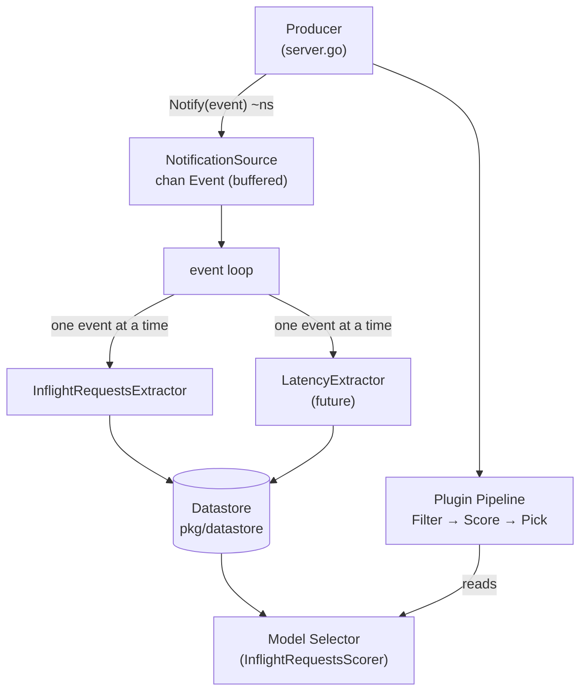

# Proposal: Data Layer

## Summary

Introduce an **Async Data Layer** — a background observation pipeline that runs
**outside the critical request path**. It collects runtime events fired by the producer
(currently `server.go`), buffers them off the hot path, and dispatches them to registered
`Extractor`s that compute aggregates and write them to the DataStore for the Model Selector.

## Goal

Track runtime information about inference requests to help make better routing decisions —
for example, which model has the least in-flight requests or the lowest average latency.
This information is read by the Model Selector (Filter / Score / Pick) when choosing
where to route each request.

## Requirements

- **Non-blocking on the critical path** - data collection must add zero latency to request handling.
- **Multiple independent extractors** - different metrics must be computable independently without coupling to each other.
- **Extensible** - adding a new metric or event type must not require changes to existing extractors or the producer.
- **Off the plugin pipeline** - the data layer is a background concern; it must not participate in the per-request plugin chain.

## Proposal

### Architecture



The **producer** (currently `server.go`) fires an `Event` on each request and response —
a non-blocking channel write (~ns). The `NotificationSource` buffers it. A background
event loop reads each event from the channel as it arrives and fans it out to all registered
`Extractor`s. Each extractor switches on `Event.Type` and handles what it understands,
ignoring the rest.

### Types (`pkg/framework/datalayer/`)

```go
type DataSource interface {
    framework.Plugin                  // TypedName() TypedName
    Start(ctx context.Context) error
    // Stop signals the component to shut down and blocks until it has fully stopped.
    Stop()
}

// Event is the uniform carrier of all data layer events.
// Type identifies what happened; Payload holds the event-specific data.
type Event struct {
    Type    EventType
    Payload any
}

// EventNotifier is the narrow interface the producer uses to fire events.
// Keeping it separate lets the server depend only on Notify, not on lifecycle
// or extractor registration.
type EventNotifier interface {
    Notify(e Event)
}

// NotificationSource buffers events off the hot path and dispatches
// each event to registered Extractors as it arrives.
type NotificationSource interface {
    DataSource
    EventNotifier
    // RegisterExtractor adds an extractor after construction.
    // Extractors known at construction time can be passed to New directly.
    RegisterExtractor(e Extractor)
}

// Extractor processes a batch of Events. It does not manage its own goroutines.
type Extractor interface {
    framework.Plugin
    Extract(ctx context.Context, events []Event) error
}
```

See [Appendix](#appendix) for payload struct definitions and a full extractor example.

### DataStore injection

The `DataStore` is passed directly to each extractor's constructor. This keeps the
`NotificationSource` a pure event dispatcher with no knowledge of storage, and avoids
routing the store through `framework.Handle`.

```go
ds := datastore.NewStore()
extractor := inflightrequests.NewInflightRequestsExtractor(ds)
```

### Registration (`runner.go`)

```go
ds := datastore.NewStore()
src, err := notificationsource.New("default", inflightrequests.NewInflightRequestsExtractor(ds))
if err != nil { ... }
if err := src.Start(ctx); err != nil { ... }
// TODO: pass src to the producer so it can call src.Notify(...)
```

**Next:** define a configuration story for data layer plugins (NotificationSource, extractors)
consistent with how model-selector plugins are configured via CLI flags.

## Future

- **LatencyExtractor** - handles `ResponseEventType`; per-model avg latency; owns `"pool-latency"` attribute
- **PollingDataSource** - polls inference pool `/metrics` on a ticker; same `Extractor` interface

## Implementation Steps

1. Add `DataSource`, `DataStore`, `EventNotifier`, `Event`, `NotificationSource`, `Extractor`, payload types to `pkg/framework/datalayer/`
2. Implement `NotificationSource` (buffered channel + event loop) in `pkg/plugins/datalayer/notificationsource/`
3. Implement `InflightRequestsExtractor` in `pkg/plugins/datalayer/inflightrequests/`
4. Implement `InflightRequestsScorer` in `pkg/framework/modelselector/scorer/inflightrequests/`
5. Wire DataStore + extractor + NotificationSource in `runner.go`
6. Add `src.Notify(...)` calls to the producer alongside existing pipeline dispatch
7. Config-driven registration of data layer plugins

---

## Appendix

### Payload types

```go
// package datalayer (pkg/framework/datalayer/)

// RequestPayload is the Payload for RequestEventType.
// Carries the already-parsed request — no re-parsing needed.
type RequestPayload struct {
    Request *framework.InferenceRequest
}

// ResponsePayload is the Payload for ResponseEventType.
// Duration is computed by the producer and passed directly.
// All response body fields are accessible via Response.Body.
type ResponsePayload struct {
    Request  *framework.InferenceRequest
    Response *framework.InferenceResponse
    Duration time.Duration
}
```

### Extractor definitions

#### `InflightRequestsExtractor` — owns `"inflight-requests"` (`pkg/plugins/datalayer/inflightrequests`)

| | |
|---|---|
| Handles | `RequestEventType` (increment), `ResponseEventType` (decrement) |
| Reads | `model`, `max_tokens` from `Request.Body` |
| State | `map[string]InflightRequestsCount` — in-flight counters per model |
| Writes | `InflightRequestsCount{Requests int64, Tokens int64}` per model |

```go
type InflightRequestsCount struct {
    Requests int64
    Tokens   int64 // sum of max_tokens across in-flight requests
}
```
